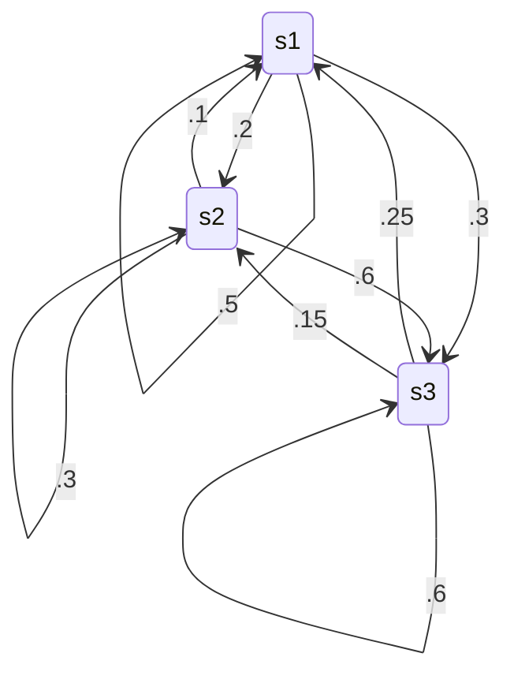

[TOC]

# Unit 4 Continued

## Transformations 

### Review

T is a linear transformation from $\R^n$ to $\R^m$ if 

1. $T(\vec{v_1}+\vec{v_2}) = T(\vec{v_1})+T(\vec{V_2})$
2. $T(a\vec{v}) = a T(\vec{v})$

Example:

Let *A* be an $m\times n$ matrix.

Define *T* from $\R^n$ to $\R^m$ by $T\vec{v} = A\vec{v}$

Then *T* is a linear transformation
$$
T(\vec{v_1}+\vec{v_1}) = A(\vec{v_1}+\vec{v_2})\\
=A\vec{v_1} + A\vec{v_2}\\
=T(\vec{v_1}) + T(\vec{v_2})\\
T(a\vec{v})\\
= aA\vec{v} = aT(\vec{v})
$$

### Theorem

Let *T* be a linear transformation from $\R^n$ to $\R^m$. Define $\begin{bmatrix} T\end{bmatrix}$ to be the matrix whose i-th column is $T(e_i)$, where $\vec{e}_i$ is the i-th column of $I_N$

Then $T(\vec{v}) = \begin{bmatrix} T\end{bmatrix}\vec{v}$ for all $\vec{v}$ in $\R^n$
$$
\begin{bmatrix}x\\
y\\
z
\end{bmatrix}
=x\begin{bmatrix}
1\\
0\\
0
\end{bmatrix}
+y\begin{bmatrix}
0\\
1\\
0
\end{bmatrix}
+z\begin{bmatrix}
0\\
0\\
1
\end{bmatrix}\\
T
\begin{bmatrix}x\\
y\\
z
\end{bmatrix}
=xT\begin{bmatrix}
1\\
0\\
0
\end{bmatrix}
+yT\begin{bmatrix}
0\\
1\\
0
\end{bmatrix}
+zT\begin{bmatrix}
0\\
0\\
1
\end{bmatrix}
$$

### Theorem

Let *T* be a linear transformation then Range(*T*) = COL($\begin{bmatrix} T\end{bmatrix}$)

$\begin{bmatrix} T\end{bmatrix}$ = $\begin{bmatrix} \vec{w_1} & \vec{v_2} & \vec{w_3} \end{bmatrix}$
$$
T\begin{bmatrix}
x_1\\
x_2\\
\vdots\\
x_n
\end{bmatrix} =\begin{bmatrix} T\end{bmatrix}
\begin{bmatrix}
x_1\\
x_2\\
\vdots\\
x_n
\end{bmatrix}
$$
*T* from $\R^n$ to $\R^m$ is onto if Rank($\begin{bmatrix} T\end{bmatrix}$) = $m$

NULL($\begin{bmatrix} T\end{bmatrix}$) is the set of vectors $\vec{v}$ for which $T(\vec{v}) = 0$ since $T(\vec{v}) = \begin{bmatrix} T\end{bmatrix} \vec{v}$ called the kernel of *T*.

#### Onto Definition

A transformation is onto if, for every vector *b* in $\R^m$, the equation $T(x) = b$ has at least one solution x in $\R^n$.

### Theorem

*T* is one-to-one if and only if NULL($\begin{bmatrix} T\end{bmatrix}$) = $\vec{0}$

Suppose $T(\vec{v}) =\vec{0}$ only for $\vec{v} = 0$, suppose 
$$
T(\vec{v_1}) = T(\vec{v_2})$ \\
T(\vec{v_1}) = T(\vec{v_2}\\
T(\vec{v_1} -\vec{v_2}) = \vec{0}\\
\
$$
Hence:
$$
\vec{v_1} - \vec{v_2} = \vec{0}\\
\vec{v_1} = \vec{v_2}
$$
$\begin{bmatrix} T\end{bmatrix} \vec{v} =\vec{0}$ Only for $\vec{v} = \vec{0}$ if Rank($\begin{bmatrix} T\end{bmatrix}$) is equal to # of columns.

*T* is a transformation from $\R^3$ to $\R^4$, it cannot be onto.

If *T* is a transform from $\R^5$ to $\R^3$ then it cannot be 1-to-1. $\begin{bmatrix} T\end{bmatrix}$ is $3\times 5$, so rank is at most 3.

## Markov Chains

Shows calculations or movement between states

### Transition Matrix

- The *ij* entry is the percentage of population moving from state *j* to *i*.

$$
\begin{bmatrix}
.5 & .1 & .25\\
.2 & .3 & .15\\
.3 & .6 & .6
\end{bmatrix}
$$

Corresponds with:

Initial state vector has the initial distribution of the pop. Into the different states.

$A\vec{v_0} = \vec{v_1}$

Where *A* is the transition matrix, $\vec{v_0}$ is the initial state. This tells you the states after a certain amount of time.

