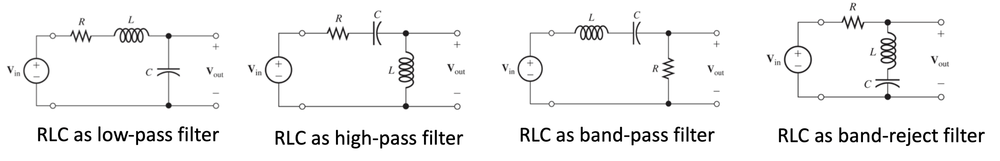
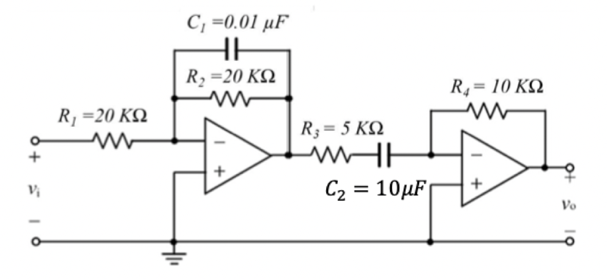

## Thévenin

$Z_{thev} = \frac{V_t \angle \theta}{I_{sc}\angle\theta}$

Or 

$R_t = \frac{v_{oc}}{i_{sc}}$

## Impedances

### Inductor

$Z_L = j\omega L$

### Capacitor

$Z_C=\frac{-j}{\omega C}$

### Impedance Relationship

$Z=\frac{V}{I}$

## Convert from rad/s to frequency

$$
\frac{\omega}{2\pi} =f_{req}
$$

## First Order Filters

### RC Half Power

$$
f_B=\frac{1}{2\pi RC}
$$

### RL Half Power

$$
f_B = \frac{1}{2\pi \frac{L}{R}}
$$

### Low Pass Transfer Function (RC & RL)

$$
H(f)=\frac{V_{out}}{V_{in}} = \frac{1}{1+j\frac{f}{f_b}}
$$

Transfer function is a ratio so if you were to run $5\cos(300\pi t+20)$ through it, this would be the way it would appear:
$$
V_{out}(f) = 5\angle20 \frac{1}{1+j\frac{f}{f_b}}
$$

### Magnitude to DB

| $|H(f)|$               | $|H(f)|_{db}$ |
| ---------------------- | ------------- |
| 100                    | 40            |
| 10                     | 20            |
| 2                      | 6             |
| $\sqrt{2}$             | 3             |
| 1                      | 0             |
| ${\frac{1}{\sqrt{2}}}$ | -3            |
| $\frac{1}{2}$          | -6            |
| 0.1                    | -20           |
| 0.01                   | -40           |

Notice this follows this:
$$
|H(f)|_{dB} = 20\log|H(f)|
$$

Cascaded filters can also be multiplied together.

## Second Order Filters

The resonant frequency $f_0$  of an RLC circuit is the frequency that makes the RLC circuit equivalent impedance <u>purely resistive.</u>

### At resonant Frequency

$$
|Z_{inductor}| = |Z_{capacitor}|
$$

$$
2\pi f_0 = \omega = \frac{1}{\sqrt{LC}}
$$

### Quality Factor

$$
\frac{2\pi f_0 L}{R} = Q_s = \frac{1}{2\pi f_0 RC}
$$

When $Q_s$ is less than .5 the circuit is **overdamped** - R is large enough to absorb any energy oscillation 

When $Q_s$ is equal to .5 the circuit is **critically damped**

When $Q_s$ is more than .5 the circuit is **underdamped** - energy oscillations are possible

## Realistic Second Order Filter

Cascaded filters are unrealistic because the second filter will change the half power frequency of the first filter. For cascaded filters, the gain of the first filter must be computed with the equivalent impedance of the 2nd filter connected to it to account for this loading effect.

### Low Pass Op-Amp

$$
f_b = \frac{1}{2\pi R_1C_1}\\
\text{Value from image below: }\\
f_b = \frac{1}{2\pi (20000)(0.01\times 10^{-6})}=795.77\text{Hz}
$$

### High Pass Op Amp

$$
f_b=\frac{1}{2\pi R_3C_2}\\
\text{Value from image below: }\\
f_b = \frac{1}{2\pi (5000)(10\times 10^{-6})}=3.183\text{Hz}
$$

$$
\text{This shows a low pass filter and a high pass filter together.}\\ \text{The cutoff freqs are above.}
$$

These can actually be combined into a single band-pass filter.

## Some Op-Amp Equations

Inverting Amp: $v_0 = -\frac{R_2}{R_1}v_i$

Noninverting Amp: $v_0 = (1+\frac{R_2}{R_1})v_i$

Voltage Follower: $v_0 = v_i$

Difference Amp: $v_0 = \frac{R_2}{R_1}(v_2-v_1)$