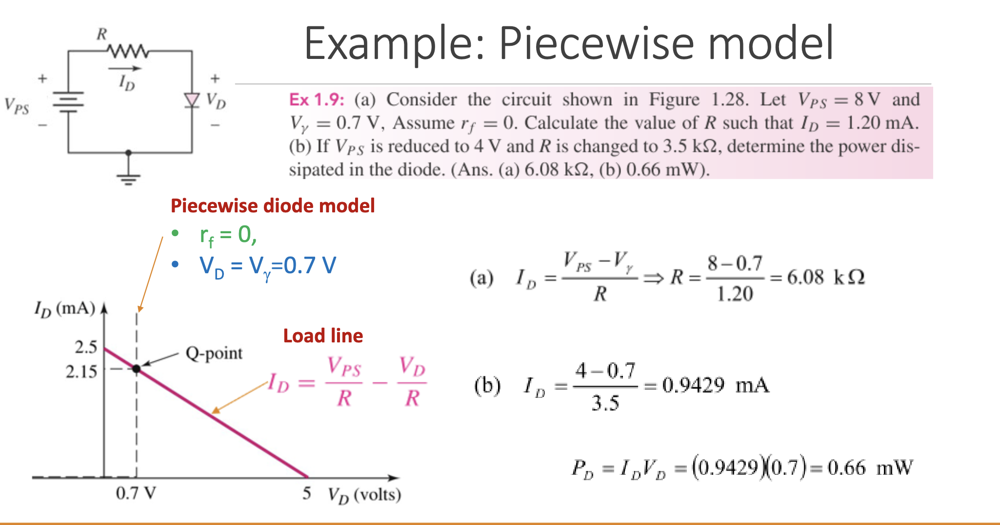

# On the PN Junction

Now when you put two of these oppositely doped semiconductors together you get a PN junction.

### PN Junctions have a voltage potential

Building off of what we learned previously

$V_{bi}=\frac{kT}{e}\ln({\frac{N_aN_d}{n^2_i}})$

Generally we can simplify this a bit because at room temperature $\frac{kT}{e}=0.026V=V_T$

So $V_{bi}=V_T\ln({\frac{N_aN_d}{n_i^2}})$

## Diode Models

I like to separate down diodes into three different "cases" in which we evaluate them.

### 1. Ideal Diode

$I_s$ is the reverse-bias saturation current

$n$ is the emission coefficient $1\leq n \leq 2$ where

- $n=1$ at high current (mainly diffusion in neutral region)
- $n=2$ at low current (mainly recombination)

This makes this fun equation:

$i_D = I_S(e^{\frac{v_D}{nV_T}}-1)$

But because we mainly worry about the high current ($n=1$)

$I_D = I_S(e^\frac{v_D}{V_T} - 1)$

And remember that $v_D$ is the applied voltage across the diode.

### 2. DC Model of Ideal Diode

In this model a diode is either ON or OFF with no in-between. When on its assumed that theres no voltage drop and zero resistance. Once $v_D$ is greater than 0, the resistance drops to zero.

### 3. Piecewise Linear Model of Diode

As an intermediary between then the incredibly simplified linear diode and the ideal diode.

**Something that I never understood is in this context of discussing diode models, *when you see a resistor in series with an ideal diode, it serves as a model representation rather than implying there are always physical resistors alongside diodes. THE RESISTOR AND THE "VOLTAGE SOURCE" REPRESENT JUST A DIODE***. *This series resistor, $r_f$, models the incremental resistance of the diode when it's conducting. It represents the slight increase in voltage across the diode for a  corresponding increase in current. This is distinct from the bulk  resistance of the semiconductor material; it's a dynamic resistance that depends on the operating point.*

And you'll see this too with the diode piecewise circuit is a resistor and a "voltage source" with $v_\gamma$. In this context we just pretend that the $v_\gamma$ never causes the current to flow backwards and it matches the input voltage up to a point and then stays there. It's kind of a tacky simplification but it does "work" in the forward biased condition.

**The very important voltage law equation to draw the load line**:

$I_D = \frac{V_{PS}}{R} - \frac{V_D}{R}$

This is probably the best slide in the whole deck (TODO make this work with hosting):

Its a great example illustrating how you can draw the load line, $r_f$ is often simplified to $0$ so you basically just solve for $R$ at $0.7V$.
$$
\frac{1.2}{1000}=\frac{8}{x}-\frac{0.7}{x}\\
x=6.08k\ohm\\
$$

### Q Point = Quiescent point = Operating Point

The operating point (Q-Point) is the point that represents the device behavior under certain loads.

### Iteration

- Iteration is a method used to find the operating point of non-linear circuits. The idea is to make an initial guess, use that to calculate the circuit's behavior, then refine the guess based on the results, and repeat this process until the results converge to a stable value.

- For diode circuits, a common iterative technique is the "load line" method, where you overlay the diode's I-V curve with a load line representing the rest of the circuit. The point of intersection gives the Q-point.

Uhhhhhh so why do we make iterative guesses? Can't we just solve for it you ask? Well the equation is non-linear, so it's often impossible to find a closed-form solution directly. The $e^\frac{V_d}{V_T} - 1$ does NOT allow for an easy algebraic approach.

**The very important voltage law equation to draw the load line**:

$I_D = \frac{V_{PS}}{R} - \frac{V_D}{R}$

And then basically the operating point is where the intercepts the piecewise or the load line:

$I_D = I_S(e^\frac{V_D}{V_T}-1)$ for ideal (as a refresher). This could also be the piecewise model.

### Graphical Analysis

- Graphical analysis often complements iterative methods. For non-linear components, their behavior can be plotted on a graph (e.g., the I-V characteristic of a diode).
- The operating point can be found graphically by plotting the characteristic curve of the diode and the load line for the rest of the circuit on the same graph. The intersection of these two curves represents the Q-point of the circuit.
- This method is particularly insightful because it provides a visual representation of the circuit's behavior. You can immediately see how changing a certain parameter (like a resistor value) will shift the Q-point.