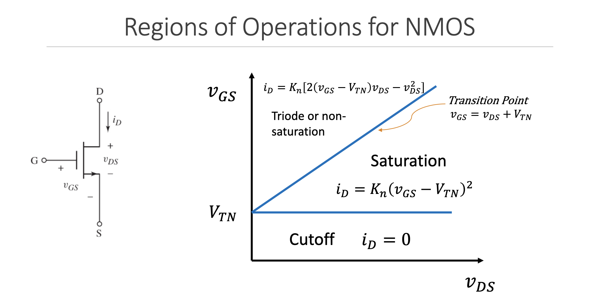

[TOC]

# On the FETs

TODO the conceptual understanding of the electron inversion layer and stuff.

## Use the damn chart

|                          | NMOS                                        | PMOS                                       |
| ------------------------ | ------------------------------------------- | ------------------------------------------ |
| Triode or Non-Saturation | $v_{DS}< v_{GS} -V_{TN}$                    | $v_{SD}<v_{SG}+V_{TP}$                     |
|                          | $i_D=K_n[2(v_{GS} -V_{TN})v_{DS}-v_{DS}^2]$ | $i_D=K_p[2(v_{SG}+V_{TP})v_{SD}-v^2_{SD}]$ |
| Saturation               | $v_{DS} \geq v_{GS} -V_{TN}$                | $v_{SD}\geq v_{SG} +V_{TP}$                |
|                          | $i_D=K_n(v_{GS}-V_{TN})^2$                  | $i_D=K_p(v_{SG}+V_{TP})^2$                 |
| Cutoff                   | $v_{GS}<V_{TN}$                             | $v_{SG}<-V_{TP}$                           |
|                          | $i_D = 0$                                   | $i_D= 0$                                   |
|                          |                                             |                                            |
| Transition Point         | $v_{DS}(sat)=v_{GS}-V_{TN}$                 | $v_{SD}(sat)=v_{SG}+V_{TP}$                |
| Enhancement Mode         | $V_{TN} > 0$                                | $V_{TP}<0$                                 |
| Depletion Mode           | $V_{TN} < 0$                                | $V_{TP}>0$                                 |

And remember:

Lets talk about NMOS and PMOS an try to recontextualize them.

- NMOS - classic transistor, allows current to flow when a positive voltage is applied
- PMOS (chaotic evil). Allows current to flow when negative voltage is applied. Allow LESS current to flow when a positive voltage is applied. This positive/negative voltage distinction is important for enhancement/depletion.

For both NMOS and PMOS transistors, the gate voltage that matters for turning the transistor on or off is relative to the **source** terminal. This voltage difference is referred to as $V_{GS}$ (Voltage between Gate and Source).

- NMOS
  - To turn it "on", the gate voltage ($V_G$) should be more positive than the source voltage ($V_S$) by at least a threshold voltage ($V_{TH}$). So, $V_{GS}$ should be greater than $V_{TH}$.
- PMOS
  - To turn it "on", the gate voltage ($V_G$) should be more negative than the source voltage ($V_S$) by at least a threshold voltage ($V_{TH}$). So, VGSVGS should be less than $-V_{TH}$.

It's essential to remember this relative nature of the gate voltage to the source because the source voltage can change, especially in circuits where the transistor is not in a simple switch configuration. This means that the absolute gate voltage needed to turn on a MOSFET can vary depending on the source voltage.

Okay but theres a ton of modes there, lets break them down

### Triode / Non Saturation

- The MOSFET behaves like a variable resistor. The resistance between drain and source is controlled by the gate voltage.

### Saturation

- The MOSFET is fully on and conducts maximum current from drain to source. This is the mode in which MOSFETs are typically operated for amplification.

### Cutoff

- The transistor is fully "off," and no current flows from collector to emitter.

### Transition Point

- This isn't really a "mode" but rather a point. It's the point between cut-off and active mode, where the transistor just starts to turn on.

### Enhancement Mode

- Material / manufacturing property (see table below)

### Depletion Mode

- Material / manufacturing property (see table below)

## More on Enhancement / Depletion

In the context of transistors "ON" refers to the transistor being in a conducting state, allowing current to flow between drain and source. "OFF" means minimal current flow:

|                  | NMOS                                                         | PMOS                                                         |
| ---------------- | ------------------------------------------------------------ | ------------------------------------------------------------ |
| Enhancement Mode | Normally OFF Turns ON with positive $V_{GS}$            | Normally OFF Turns ON with positive $V_{SG}$ (negative $V_{SG}$) |
| Depletion Mode   | Normally ON Turns OFF or reduces conduction with negative $V_{GS}$ | Normally ON Turns OFF or reduces conduction with negative $V_{SG}$ (positive $V_{GS}$) |

### One more equation for the road

For NMOS

$K_n = \frac{W\mu_n C_{ox}}{2L} = k'_n \frac{W}{2L}$

For PMOS

$K_p = \frac{W\mu_p C_{ox}}{2L}=k'_p \frac{W}{2L}$

Oxide Layer Capacitance

$C_{ox}=\epsilon_0 / t_{ox}$

I honestly have no idea what these mean.