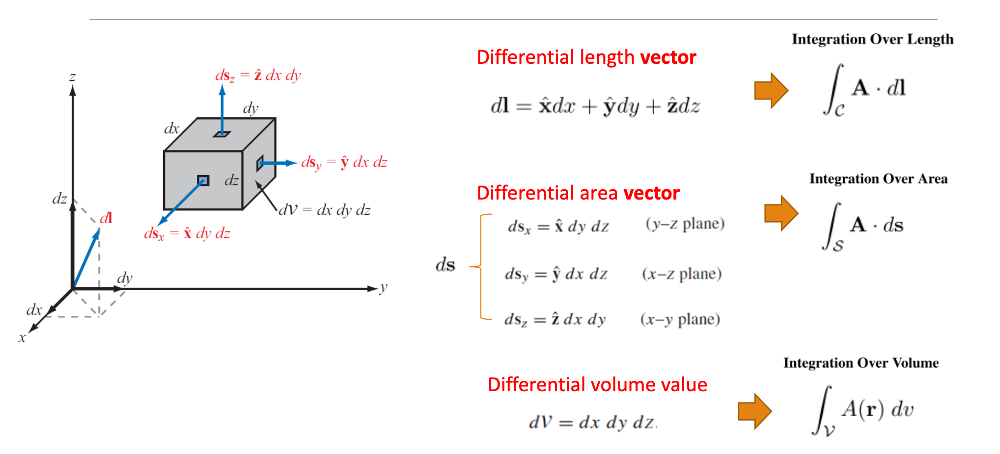
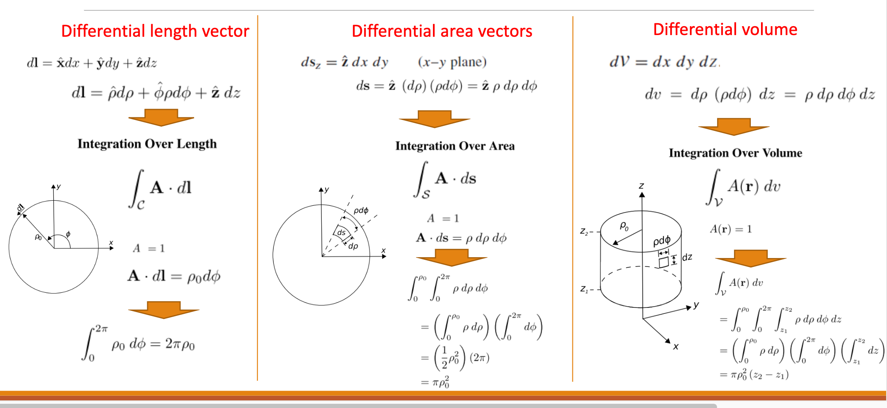
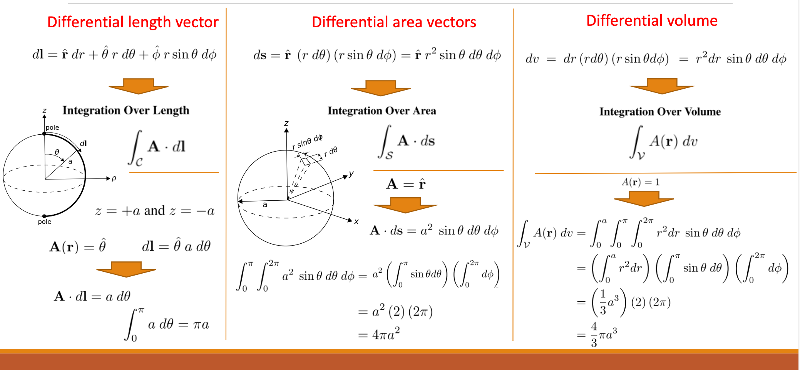
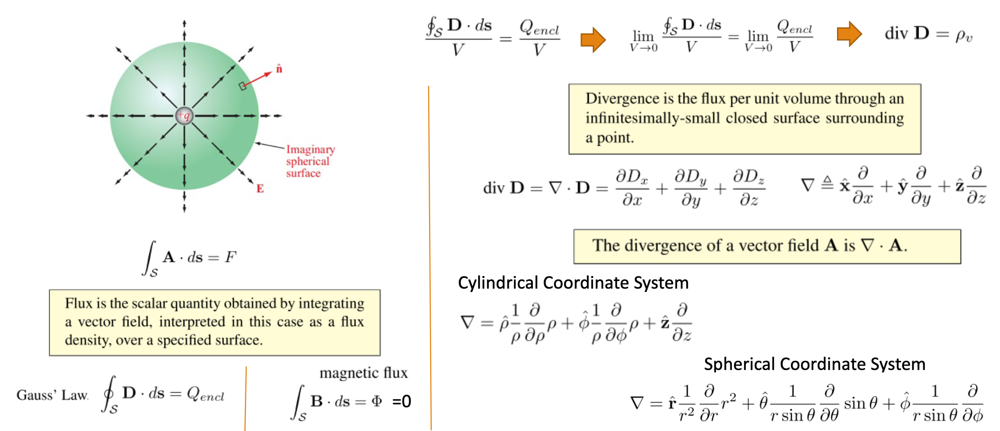
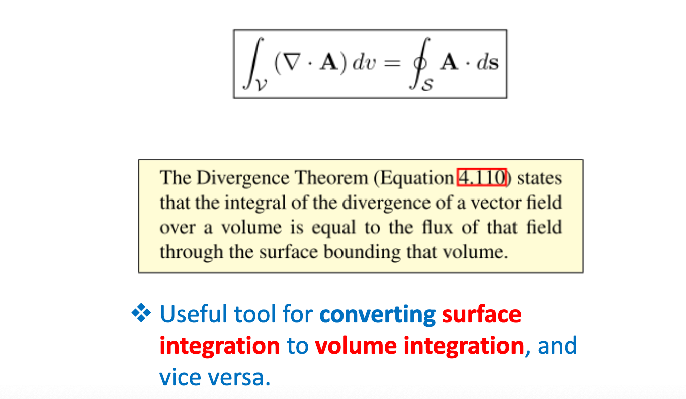
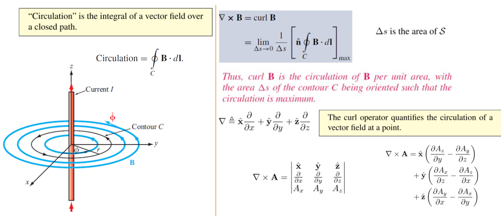
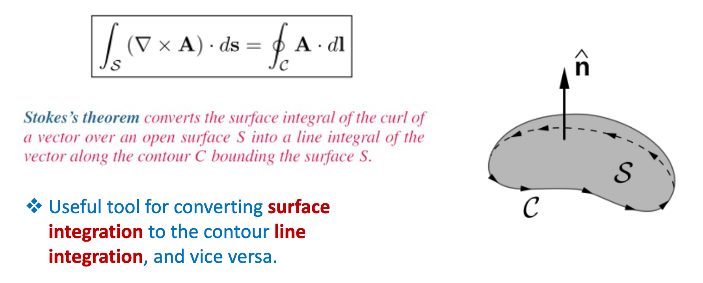
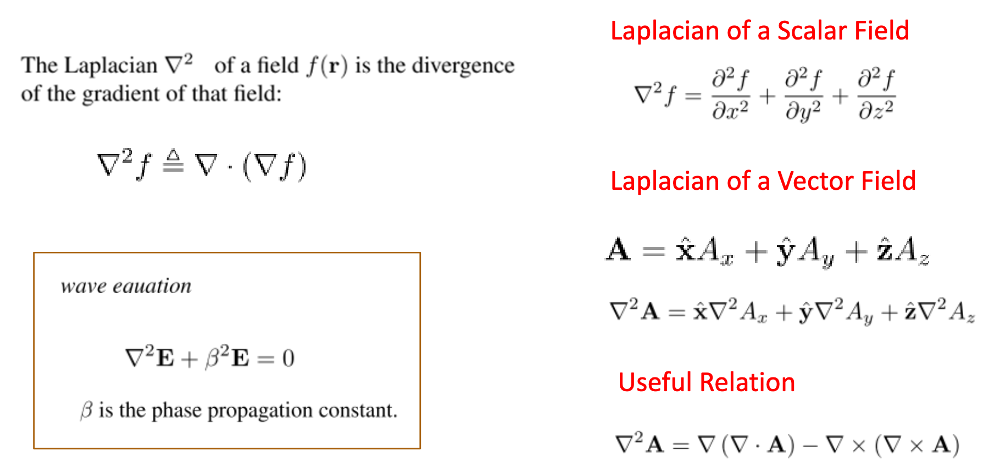

[TOC]

# Vector Analysis

## Confusing Items

- Line integration
- Stokes/curl/divergence

## Bloatware

Convert radians to degrees using $deg \cdot \frac{\pi}{180} = rad$

$\int \sin(x)dx = -\cos(x)$

When you see this integral: $\oint_C$ that just means C is any valid path which encloses ~whatever~ in a lot of cases this is current.

## Dot Product

In this case where $\times$ is mentioned this just classic scalar multiplication and **not** cross product. Basically you just multiply the corresponding components and add.

### 2D

For $A=(a_1, a_2)$ and $B=(b_1, b_2)$

In 2D $A\cdot B = a_1 \times b_1 + a_2 \times b_2$

Hypothetically $A\cdot B= AB\cos(\psi)$ where the angle between them is $\psi$

### 3D
For $A=(a_1, a_2, a_3)$ and $B=(b_1, b_2, b_3)$
In 3D $a_1\times b_1 + a_2\times b_2 + a_3 \times b_3$

### Component of $\vec{a}$ along $\vec{b}$

$comp_B A = \frac{\vec{a}\cdot \vec{b}}{|b|}$

Now for the projection you just multiply the scalar to find A in the direction of B

$proj_B A = comp_B A \times B$

## Cross Product

The cross product between two 3D vectors results in a vector that is perpendicular to both of the original vectors. The magnitude of this vector is proportional to the area of the parallelogram spanned by the two vectors.

For $A=(a_1, a_2, a_3)$ and $B=(b_1, b_2, b_3)$, the cross product $A \times B$ is calculated as:

$A \times B = \begin{pmatrix} i & j & k \\ a_1 & a_2 & a_3 \\ b_1 & b_2 & b_3 \end{pmatrix}$

This determinant expands to:

$
A \times B = (a_2 \cdot b_3 - a_3 \cdot b_2)i - (a_1 \cdot b_3 - a_3 \cdot b_1)j + (a_1 \cdot b_2 - a_2 \cdot b_1)k$

Or written in vector component form:

$A \times B = ((a_2b_3 - a_3b_2),\, -(a_1b_3 - a_3b_1),\, (a_1b_2 - a_2b_1))
$

The cross product can also be used to determine the angle between the two vectors using the formula:

$
\| A \times B \| = \|A\| \|B\| \sin(\theta)
$

where $\|A\|$ and $\|B\|$ are the magnitudes of vectors $A$ and $B$, respectively, and $\theta$ is the angle between them.

## Cartesian Coordinates

## Cylindrical Coordinates

For area, don't forget to multiply by $z$.

## Spherical Coordinates

Length Vector:

$dl = \hat r dr + \hat \theta r d\theta + \hat \phi r \sin(\theta) d\phi$

The integral of $\sin(\theta)$ is $-\cos(\theta)$ (probably not needed)

## Vector Operations in Cylindrical Coordinates

TODO

## Vector Operations in Spherical Coordinates

TODO

## Gradient of a field

$\nabla f = \hat x \frac{\partial f}{\partial x} + \hat y \frac{\partial f}{\partial y}+ \hat z \frac{\partial f}{\partial z}$

## Divergence

$A=A_p a_p + A_\phi a_\phi + A_za_z$

$\nabla \cdot A = \frac{1}{p}\frac{\partial(pA_p)}{\partial p} + \frac{1}{p}\frac{\partial A_\phi}{\partial\phi} + \frac{\partial A_z}{\partial z}$

$\nabla \cdot H$ is the divergence of a vector field **H**. 

## Divergence Theorem

## Curl of a Vector Field

## Stokes's Theorem

## Laplacian Operator

