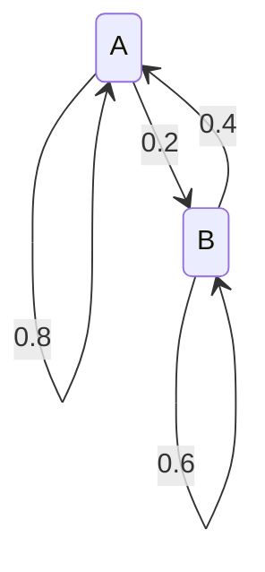

# Mapping

## Theorem

Suppose *T*: $\R^n \rarr \R^m$ is the linear transformation $T(v)=Av$ where *A* is an $m\times n$ matrix then: $\darr$

### One-to-one

*T* is one-to-one if and only if the columns of *A* are linearly independent, which happens precisely when *A* *has a pivot position in every* **column**.

### Onto

*T* is onto if and only if the span of the columns of *A* is $\R^m$, which happens precisely when *A* *has a pivot position in every* **row**.

# Matrices

## Markov Chains

#### Some notes on probability matrices

All probability matrices that are are given with columns summing to one have two different Eigenvectors. One will always be on the line $y=-x$, the other line is what we're actually solving for.

Also a probability matrix is just when the column adds to one. The span is a line, but it's only a probability matrix when the vector tip lays on $x+y=1$. This is what we're solving for in probability matrices.

### Methods with **stochastic** (probability) matrix

#### If **Rows** Add to 1

We haven't encountered one of these in class yet, so **this most likely shouldn't be used**.

[This video has a good explanation *of this type*](https://www.youtube.com/watch?v=cP3c2PJ4UHg)

Use row vector format:

$v=[x\ \ y]$
$$
vP=v\\
vP-v=0\\
v(P-1\cdot I)=0\\
\text{Subbing in an example:}\\
[x\ \ y](\begin{bmatrix}
.6 & .4\\
.15 & .85
\end{bmatrix}-
\begin{bmatrix}
1 & 0\\
0 & 1
\end{bmatrix})=0\\
[x\ \ y](\begin{bmatrix}
-.4 & .4\\
.15 & -.15
\end{bmatrix})=0\\
\text{Make equations by distributing:}\\
-.4x+.15y=0\\
.4-.15y=0\\
\text{notice one is redudant, we'll get rid of it}\\
\text{we'll also notice that the x and y's have to add to 1 so:}\\
x+y=1\\
\text{this means:}\\
x+y=1\\
.4x-.15y=0\\
\text{put into matrix and reduce:}\\
\begin{bmatrix}
1 & 1 & | & 1\\
.4 & -.15 & | & 0
\end{bmatrix}\\
\darr\\
\begin{bmatrix}
1 & 0 & | & \frac{3}{11}\\
0 & 1 & | & \frac{8}{11}
\end{bmatrix}\\
v=[\frac{3}{11}\ \ \frac{8}{11}]
$$

#### If **Columns** Add to 1

[This video has a good explanation of *this* type](https://www.youtube.com/watch?v=8noldJCb86Y)

Find the steady-state distribution vector for the regular Markov chain whose transition matrix is:

$T=\begin{bmatrix}
.7 & .2\\
.3 & .8
\end{bmatrix}$

*Notice with this example the **columns** are adding to one as opposed to the method above, which was **rows***.
$$
\begin{bmatrix}
.7 & .2\\
.3 & .8
\end{bmatrix}\begin{bmatrix}
x\\
y
\end{bmatrix}=
\begin{bmatrix}
x\\
y
\end{bmatrix}\\
\text{we know that the x and y's have to sum to 1 again}\\
x+y=1\\
\text{we can also pull out our other two equations}\\
0.7x+0.2y=x\\
0.3x+0.8y=y\\
\text{move x and y to the left}\\
-0.3x+0.2y=0\\
0.3x-0.2y=0\\
\text{perform row reduction on all three}\\
\begin{bmatrix}
1 & 1 & | & 1\\
-.3 & .2 & | & 0\\
.3 & -.2 & | & 0
\end{bmatrix}\\
\darr\\
\begin{bmatrix}
1 & 0 & | & .4\\
0 & 1 & | & .6\\
0 & 0 & | & 0
\end{bmatrix}\\
x=0.4,\ y=0.6\\
\text{steady state:}\ L=\begin{bmatrix}
0.4\\
0.6
\end{bmatrix}
$$
*The method given in class is better on an exam for finding the steady state, this one just skips many steps*

### General method for **Non stochastic** **or** **stochastic** matrix (recommended)

#### Given in class

$$
A = \begin{bmatrix}
1 & 3\\
3 & 1
\end{bmatrix}\\

A-\lambda I = \begin{bmatrix}
1 & 3\\
3 & 1
\end{bmatrix}-\lambda \begin{bmatrix}
1 & 0\\
0 & 1
\end{bmatrix}=\begin{bmatrix}
1-\lambda & 3\\
3 & 1-\lambda
\end{bmatrix}\\

det(A-\lambda I) = (1-\lambda)^2-9\\
\lambda^2-2\lambda +1=9\\
(\lambda-4)(\lambda+2)=0\\
\text{eigenvalues:}\ \lambda_1=4, \lambda_2=-2\\
\text{Now find coresponding eigenvectors:}\\
\text{We need }\ \vec{x}\ \text{of}\ (A-\lambda_1 I)\vec{x}=\vec{0}\\
\text{Substitute in}\\

(\begin{bmatrix}
1 & 3\\
3 & 1
\end{bmatrix}-\begin{bmatrix}
4 & 0\\
0 & 4
\end{bmatrix})\begin{bmatrix}
x_1\\
x_2
\end{bmatrix}=\vec{0}\\
(\begin{bmatrix}
-3 & 3\\
3 & -3
\end{bmatrix})\begin{bmatrix}
x_1\\
x_2
\end{bmatrix}=\vec{0}\\
\text{reduce (for 2x2 this is not neccesary)}\\
\begin{bmatrix}
-3 & 3\\
0 & 0
\end{bmatrix}\\
-x_1+x_2=0\\
E_{\lambda_{1}}=span(\begin{bmatrix}
1\\
1
\end{bmatrix})\\
\\
\\
\text{The other solution is the same, but with -2}\\
(\begin{bmatrix}
1 & 3\\
3 & 1
\end{bmatrix}-(-2)\begin{bmatrix}
1 & 0\\
0 & 1
\end{bmatrix})\begin{bmatrix}
x_1\\
x_2
\end{bmatrix}=\vec{0}\\
\begin{bmatrix}
3 & 3\\
3 & 3
\end{bmatrix}
\begin{bmatrix}
x_1\\
x_2
\end{bmatrix} =\vec{0}\\

x_1+x_2=0\\
E_{\lambda_2}=span(\begin{bmatrix}
1\\
-1
\end{bmatrix})
$$

Notice that the final vector can be solved for by solving for $x_1$ then creating an $x_2$. Heres an example on the last lambda:

$x_1+x_2=0 \larr$ given above 

Now
$$
x_1+x_2=0\\
x_2=x_2\\
\text{so}\\
x_1=-x_2\\
\text{so now create a matrix:}
\begin{bmatrix}
-1\\
1
\end{bmatrix}\\
\text{Notice the span of this matrix is the same as the solution for} E_{\lambda_2}
$$
This is probably the easiest way to solve for the spanning vector.

## Reducing a Complex Number Matrix

Normally involves multiplying by the conjugate in the matrix to simplify:
$$
\text{Given this:}\\
\begin{bmatrix}
2+2i& 2\\
-4 & -2+2i
\end{bmatrix}\\
\text{simplify the first row with the conjugate:}\\
\begin{bmatrix}
2+2i& 2\\
-4 & -2+2i
\end{bmatrix}\\
R_1:=R_1\cdot\frac{1-i}{4}\\
\begin{bmatrix}
1 & \frac{1-i}{2}\\
-4 & -2+2i
\end{bmatrix}
$$
Now simplification is easy, just $R_2:=R_2+4R_1$.

### Interpreting Markov Chains

The way states are represented can be the other way than we're doing it here, but in general for this class we follow this format:
$$
\begin{bmatrix}
 & \text{Current State A} & \text{Current State B}\\
\text{Next State A} & 0.8 & 0.4\\
\text{Next State B} & 0.2 & 0.6
\end{bmatrix}
$$
This matrix is stating four things:

State A $\rarr$ State A is $0.8$

State A $\rarr$ State B is $0.2$

State B $\rarr$ State A is $0.4$

State B $\rarr$ State B is $0.6$

## Inverses

### Properties

- If *A* is invertible and $Ax=b$ then $x=A^{-1}b$ is a solution
- $(AB)^{-1} \neq A^{-1}B^{-1}$ but $(AB)(AB^{-1})=I$
- If a matrix is invertible, so is its transpose
- $A^2$​ is invertible if *A* is invertible
- **Invertible if the RREF is the identify matrix**
- You can solve an equation $A\vec{x} = \bold{b}$ by doing $A^{-1}A\vec{x}=A^{-1}\bold{b}$ because $A^{-1}A = I$ so $\vec{x} = A^{-1}\bold{b}$

## Subspaces

### Properties

- Has to be a "space," - a span is always the smallest subspace for a set of vectors.
- Must include the zero vector
- In general, a line or plane in $\R^3$ is a subspace if an only if it passes through the origin
- A line in $\R^2$ is a subspace of $\R^2$, a plane in $\R^3$ is a subspace in $\R^3$

## Rank-Nullity

- The number of columns is the same as the nullity + rank.